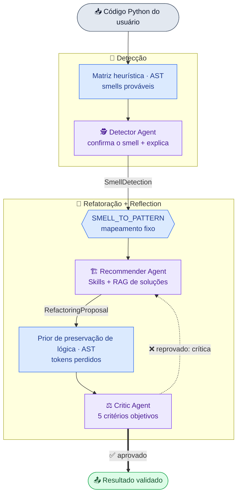

# refactor-os
### Sistema multi-agente determinístico para refatoração orientada por Design Patterns

> Detecta *bad smells* em código Python, sugere o Design Pattern adequado, reescreve o
> código preservando o comportamento e **valida a si mesmo** — tudo de forma medível.

---

## 1. Contexto — o que é o projeto

O **refactor-os** é um pipeline de **três agentes de IA especializados** que recebe um
trecho de código Python e devolve uma **refatoração explicável e validada**.

O que ele faz, de ponta a ponta:

1. Recebe o código-fonte do usuário (via API).
2. **Detecta** qual *bad smell* existe e onde (linhas + evidência).
3. **Recomenda e aplica** o Design Pattern correto, reescrevendo o código.
4. **Revisa** a própria refatoração contra critérios objetivos; se reprovar, **corrige em loop**.
5. Devolve: smell encontrado, evidências, pattern aplicado, código refatorado e a justificativa arquitetural.

**Escopo fechado e controlado** — 5 *bad smells*, cada um com **um único** pattern permitido:

| Bad smell | Design Pattern |
|---|---|
| Complex/Long Switch Statements | Strategy |
| Long Parameter List | Builder / Parameter Object |
| God Class | Facade / SRP |
| Tight Coupling | Dependency Injection |
| Duplicated Code | Template Method |

Stack: **FastAPI** (API) · **Agno** (orquestração de agentes) · **Mistral** ou **Ollama
local (Mistral/Qwen)** (LLM) · **Postgres + pgvector** (RAG) · **AST/radon/ruff** (análise estática).

---

## 2. Problema — o que queremos resolver

Refatorar código legado para Design Patterns é caro e inconsistente:

- **Conhecimento especializado e escasso.** Reconhecer um *smell* e mapeá-lo ao pattern
  correto exige experiência sênior; revisão manual não escala.
- **LLM puro é não-determinístico e "alucina".** Pedir "refatore esse código" a um LLM
  genérico gera respostas que mudam a cada execução, inventam patterns fora de escopo,
  **quebram a lógica** ou mudam a **API pública** sem avisar.
- **Falta de garantia e de medição.** Não basta "parecer melhor" — é preciso garantir que
  a lógica foi preservada e **provar com números** que o sistema acerta.

> **Desafio central:** usar LLMs para uma tarefa de engenharia **sem** abrir mão de
> determinismo, escopo e avaliação rigorosa.

---

## 3. A solução — visão geral

Um **pipeline determinístico** (Detector → Recommender → Critic) coordenado em Python,
não por um LLM-orquestrador. Cada agente tem papel exclusivo, contrato de entrada/saída
tipado (Pydantic) e ferramentas determinísticas.



**Legenda:** 🟦 etapa **determinística** (heurística, mapeamento, prior de lógica) · 🟪 **agente LLM** · 🟩 saída validada · seta pontilhada = **loop de reflexão**.

> Dois **priors determinísticos** simétricos alimentam os agentes-juízes: a **matriz
> heurística** dá ao Detector os smells prováveis; o **prior de preservação de lógica**
> dá ao Critic os tokens que sumiram entre original e refatorado. Em ambos, o LLM confirma.

**Três princípios de design:**

1. **Determinismo onde dá** — o que pode ser regra (mapeamento smell→pattern, métricas
   AST, checagem de sintaxe/API) **não** vai para o LLM.
2. **LLM só onde é insubstituível** — confirmar nuance, **escrever** o código refatorado,
   **julgar** semântica.
3. **Contratos rígidos** — cada estágio fala via schema Pydantic (`SmellDetection`,
   `RefactoringProposal`, `ReflectionReview`), e o escopo é fechado nos 5 pares.

---

## 3.1 Orquestração — Prompt Chaining + Reflection

O `RefactorService` encadeia os três agentes em ordem fixa e roda um **loop de reflexão**:

- Detector → Recommender → Critic.
- Se o Critic **reprova**, sua `critique` é injetada no próximo prompt do Recommender,
  que **corrige** — até `MAX_REFLECTION_ITERATIONS` (padrão 3) ou aprovação.
- O loop é coordenado **em Python**, não pela Agno `Team`. Isso garante: (i) ordem fixa,
  (ii) número exato de iterações, (iii) **cada estágio mensurável isoladamente** — o que
  é essencial para a avaliação (§4).

**Saída estruturada:** cada agente usa `output_schema` (Pydantic) + um `parser_model`
(segunda chamada ao LLM que extrai o JSON), contornando a incompatibilidade entre
JSON-mode e tool-calling na mesma chamada.

---

## 3.2 🕵️ Detector — encontra o smell

**Papel:** identificar **um** dos 5 *bad smells* (ou "nenhum"), com linhas e evidência.

**Como funciona — matriz heurística como *prior* determinístico:**

1. Antes do LLM, o `heuristic_engine` parseia o **AST** e **ranqueia** os smells prováveis
   por sinais estruturais explícitos:

   | Smell | Sinal heurístico |
   |---|---|
   | Complex Switch | ramos `if/elif` ou `match/case` ≥ 3 |
   | Long Parameter List | função com ≥ 5 parâmetros |
   | God Class | classe com > 20 membros (métodos + atributos) |
   | Tight Coupling | colaborador concreto instanciado dentro da classe |
   | Duplicated Code | mesmo método substancial repetido em ≥ 2 classes |

2. Esse *prior* é **injetado no prompt**; o **LLM confirma ou refuta** com base no código
   e produz o `reasoning` explicável. A matriz reduz a dependência do LLM sem torná-lo
   rígido (ele ainda decide e justifica divergências).

**Usa:** `heuristic_engine` (AST puro) + `ast_analyzer_tool` (radon: complexidade).
**Entrega:** `SmellDetection { has_smell, smell_type, line_start/end, affected_snippet, reasoning }`.

> A matriz sozinha já acerta **10/10** o tipo de smell no dataset rotulado, com **0 falsos
> positivos** no conjunto limpo — então o LLM parte de uma base forte.

---

## 3.3 🏗️ Recommender — sugere o pattern e reescreve

**Papel:** aplicar o pattern correto e produzir o **código completo refatorado**.

**Como funciona:**

1. O pattern **não é escolhido pelo LLM** — o serviço resolve deterministicamente via
   `SMELL_TO_PATTERN[smell]` e injeta no prompt o pattern + o skill obrigatórios.
2. **Skills (Agno)** — carrega o *playbook canônico* do pattern via
   `get_skill_instructions` (estrutura, regras estritas, exemplo). Uma `SKILL.md` por pattern.
3. **RAG nativo (agentic)** — `Agent(knowledge=..., search_knowledge=True)` expõe
   `search_knowledge_base`, que recupera por **similaridade semântica** um exemplo
   problema→refatoração análogo de um **corpus de soluções** (PgVector + embeddings
   HuggingFace), usado como referência adicional.
4. Reescreve o código **completo**, preservando a **lógica** e a **API pública** original.

**Usa:** Skills (filesystem) + RAG (Postgres/pgvector) + LLM.
**Entrega:** `RefactoringProposal { applied_pattern, refactored_code, architectural_explanation, expected_benefits }`.

> **Skills vs RAG (papéis distintos, sem sobreposição):** Skills = *como aplicar o pattern*
> (determinístico, por nome); RAG = *exemplos análogos* recuperados semanticamente. O
> corpus de soluções é **autoral e separado** do dataset de avaliação (ver §4).

---

## 3.4 ⚖️ Critic — valida (Reflection)

**Papel:** julgar se a refatoração é aceitável, com **critérios objetivos e numerados** (SMART).

**Os 5 critérios:**

1. **Sintaxe válida** — `syntax_checker_tool` (ast + ruff) sem erros.
2. **Lógica preservada** — nenhum ramo de controle do original foi removido sem equivalente.
   Além do `diff_generator_tool`, o Critic recebe um **prior determinístico de preservação
   de lógica** (ver abaixo) que lista os tokens comportamentais que sumiram.
3. **Pattern correto** — `applied_pattern` bate com o mapeamento obrigatório do smell.
4. **API pública preservada** — classes/métodos públicos mantidos (ou com wrapper compatível).
5. **Imports controlados** — sem dependências externas além das necessárias ao pattern.

- **Todos os 5 satisfeitos → aprova.** Qualquer falha → **reprova** e devolve uma
  `critique` que cita o número do critério e dá uma **ação corrigível** ao Recommender.
- Essa crítica realimenta o loop de reflexão (§3.1).

**Prior de preservação de lógica (contraparte da matriz heurística):** antes do LLM, o
`logic_signals` compara original × refatorado por **AST** e reporta o que *desapareceu* —
**literais, exceções levantadas e chamadas**. Refatorações legítimas reorganizam a
estrutura mas **mantêm** esses tokens (um `if/elif` vira dict de estratégias, mas os
valores e o `raise` continuam lá); então um token que some de vez é forte indício de
**regra/ramo descartado** (ex.: sumir `18.0`/`"JP"` = uma regra de frete perdida). É
injetado no prompt como evidência do Critério 2 — o Critic ainda decide.

**Usa:** `syntax_checker_tool`, `diff_generator_tool`, prior `logic_signals` + LLM.
**Entrega:** `ReflectionReview { is_approved, critique, final_validated_code }`.

---

## 3.5 Como os agentes se interligam — resumo

| Estágio | Entrada | Determinístico | LLM faz | Saída (contrato) |
|---|---|---|---|---|
| **Detector** | código | matriz heurística + AST | confirma + explica | `SmellDetection` |
| *(ponte)* | smell | `SMELL_TO_PATTERN` fixo | — | pattern + skill |
| **Recommender** | smell+pattern | Skills + RAG | escreve o código | `RefactoringProposal` |
| **Critic** | original + refatorado | sintaxe/diff + prior de lógica | julga 5 critérios | `ReflectionReview` |
| **Loop** | crítica | nº fixo de iterações | corrige | resultado validado |

**LLM plugável:** mesmo pipeline roda com **Mistral (API online)** ou **modelos locais via
Ollama (Mistral/Qwen)** — basta `LLM_PROVIDER`. Permite **comparar modelos** sob a mesma avaliação.

---

## 4. Avaliação — como é definida e feita

**Princípio:** o sistema **mede a si mesmo** contra um *ground truth* rotulado, com
**três avaliações independentes — uma por agente** (endpoints `/api/v1/evaluate/{detector,refactor,critic,all}`).

Dataset balanceado **10/10** por eixo:

```
dataset/
├── examples/   10 programas COM smell (2 por categoria)
├── clean/      10 programas LIMPOS (testam Falsos Positivos)
├── solutions/correct/    10 refatorações boas  (Critic deve aprovar)
├── solutions/incorrect/  10 refatorações ruins (Critic deve reprovar)
├── ground_truth.json     gabarito do Detector (20)
└── critic_truth.json     gabarito do Critic (20)
```

---

## 4.1 As três métricas

**1. Detector (Rastreador)** — matriz de confusão sobre `examples/` (positivos) + `clean/` (negativos):
- **Falso Negativo** = deixou passar um smell real · **Falso Positivo** = apontou smell em código limpo.
- Reporta **Precision, Recall, Accuracy, Specificity, F1** e **type_accuracy** (acertou o *tipo* do smell).

**2. Recommender (Refatorador)** — roda o pipeline nos 10 problemas e pontua a solução por
**três eixos objetivos e determinísticos** (`assess_refactoring`, sem LLM):
- **pattern correto** (== esperado) · **sintaxe válida** (ast + ruff) · **API pública preservada** (nenhum nome público some).
- `is_correct` exige os **três**. Métricas: accuracy, pattern_accuracy, syntax_valid_rate, logic_preserved_rate, taxa de aprovação no pipeline, média de iterações.

**3. Critic (Revisor)** — alimentado isoladamente com as 20 soluções rotuladas:
- **False Accept** = aprovou uma solução incorreta · **False Reject** = reprovou uma correta.
- Cada solução ruim declara um `defect_kind` (`syntax`, `logic`, `signature`, `pattern_not_applied`, `forbidden_import`).
- Métricas: accuracy, precision, recall, F1, false_accept_rate, false_reject_rate.

---

## 4.2 Por que a avaliação **não é enviesada**

- **Pipeline determinístico, sem LLM-orquestrador** → execuções reproduzíveis e cada
  estágio medido **em isolamento** (o erro de um agente não contamina a métrica do outro).
- **Julgamento por fatos, não por opinião** → a qualidade da refatoração é medida por
  **checagens estáticas** (AST, ruff, API pública), **não** por um LLM avaliando outro LLM.
- **Sem vazamento de gabarito (train/test leak):** o corpus de exemplos do RAG
  (`app/knowledge/solutions/`) é **autoral e deliberadamente distinto** do conjunto de
  avaliação (`dataset/`). O modelo nunca "vê" a resposta do teste durante a inferência.
- **Conjuntos balanceados (10/10)** e uso de **código limpo** → o Detector é cobrado por
  Falsos Positivos, não só por Recall; o Critic é testado nos **dois** sentidos de erro
  (aceitar errado / rejeitar certo).
- **Escopo fechado** → o mapeamento smell→pattern é fixo, removendo a chance de o LLM
  "acertar por sorte" sugerindo um pattern fora do gabarito.

---

## 4.3 Como o sistema pode ser avaliado (na prática)

```bash
# 1. infra
docker compose up -d postgres
curl -X POST http://localhost:8000/api/v1/knowledge/sync     # popula o RAG de soluções

# 2a. tudo de uma vez (CLI) — gera relatório .md/.json
uv run python scripts/run_evaluation.py --all \
    --md dataset/reports/evaluation.md --json dataset/reports/evaluation.json

# 2b. ou por agente, via API
curl -X POST http://localhost:8000/api/v1/evaluate/detector
curl -X POST http://localhost:8000/api/v1/evaluate/refactor
curl -X POST http://localhost:8000/api/v1/evaluate/critic
```

- **Dataset ou ad-hoc:** corpo vazio → roda sobre o dataset; corpo com `samples` → avalia
  **código submetido** pelo usuário (mesmas métricas).
- **Comparar modelos:** trocar `LLM_PROVIDER`/`LLM_MODEL_ID` (Mistral ↔ Qwen local) e
  re-rodar a mesma suíte → comparação justa sob o mesmo gabarito.
- **Reprodutível e versionado:** os relatórios ficam em `dataset/reports/`; expandir o
  dataset é adicionar arquivo + entrada no gabarito (mantendo o par 10/10).

---

## 4.4 Dados das nossas avaliações

Runs sobre o dataset 10/10 com **Mistral**. *Baseline* = antes do few-shot; *Pós-mudanças
(premium)* = após `parser_model` + Agno Skills + `arun_typed`, no tier produtivo (sem 429,
40/40 endpoints completos). Fonte: [`dataset/reports/`](../../dataset/reports/).

**Detector** — 20 arquivos (10 com smell + 10 limpos), saturado em ambos:

| Métrica | Baseline | Pós (premium) |
|---|---|---|
| Precision / Recall / F1 | 1.00 | 1.00 |
| Specificity (código limpo) | 1.00 | 1.00 |
| Type-accuracy (tipo do smell) | 1.00 | 1.00 |
| Confusão | TP 10 · FP 0 · TN 10 · FN 0 | idem |

**Recommender** — 10 problemas:

| Métrica | Baseline | Pós (premium) |
|---|---|---|
| **Accuracy** (correto nos 3 eixos) | 0.60 | **1.00** |
| Pattern correto | 1.00 | 1.00 |
| Sintaxe válida | 1.00 | 1.00 |
| **Lógica/API preservada** | 0.60 | **1.00** |
| Aprovado no pipeline | 0.70 | 1.00 |
| Iterações médias | 1.30 | 1.10 |

**Critic**:

| Métrica | Baseline (n=19) | Pós (premium, n=20) |
|---|---|---|
| Accuracy | 0.95 | 1.00 |
| F1 | 0.941 | 1.00 |
| False Accept Rate | 0.00 | 0.00 |
| **False Reject Rate** | 0.111 | **0.000** |

**Ganho baseline → pós-mudanças:** Recommender accuracy **0.60 → 1.00** e lógica preservada
**0.60 → 1.00**; Critic F1 **0.941 → 1.00** (eliminou o único *false reject*); iterações médias
1.30 → 1.10. O Detector já estava saturado em 1.00.

> ⚠️ **Free-tier × produtivo:** a run em Mistral free-tier foi comprometida por **rate-limit
> (429)** — 6/10 Recommender e 16/20 Critic falharam, derrubando os números (Recommender
> accuracy 0.40; Critic só 4/20 avaliados). É argumento para o tier produtivo ou **modelos
> locais (Ollama)** — não reflete qualidade do modelo.

> 📌 **Escopo temporal:** estes números são de jun/2026. Os dois priors determinísticos
> (matriz heurística do Detector e prior de lógica do Critic) atuam como **rede de segurança e
> reprodutibilidade**, com ganho maior em **modelos locais** mais fracos — medido em §4.5.

---

## 4.5 Modelo local (Ollama) — Mistral API × Qwen-coder 7B

Mesma suíte e mesmo gabarito, trocando apenas `LLM_PROVIDER`/`LLM_MODEL_ID`. O modelo local é o
`qwen2.5-coder:7b` (especializado em código), em GPU de 4 GB (offload parcial). Fonte:
[`dataset/reports/qwen-coder-dc.{md,json}`](../../dataset/reports/) e
[`qwen-coder-refactor.{md,json}`](../../dataset/reports/).

| Agente | Métrica | Mistral API (premium) | **Qwen-coder 7B local** |
|---|---|---|---|
| **Detector** | F1 / Specificity / Type-acc | 1.00 | **1.00** |
| | Confusão | TP 10 · FP 0 · TN 10 · FN 0 | **idem** |
| **Critic** | Accuracy / F1 | 1.00 / 1.00 | **1.00 / 1.00** |
| | False Accept / False Reject | 0.00 / 0.00 | **0.00 / 0.00** |
| **Recommender** | **Accuracy** (3 eixos) | 1.00 | **0.70** |
| | Pattern correto / Sintaxe válida | 1.00 / 1.00 | 1.00 / 1.00 |
| | API preservada | 1.00 | 0.70 |
| | Aprovado / Iterações médias | 1.00 / 1.10 | 0.90 / 1.40 |

**Leitura:**
- **Detecção e Revisão saturam em 1.00 também no modelo local** — tarefas discriminativas
  escoradas por priors determinísticos **não dependem do tamanho do LLM**.
- **Geração (Recommender) é onde o 7B local fica atrás** (0.70 vs 1.00), limitado pela
  **preservação da API pública** nos patterns que decompõem estrutura (Facade/SRP, Template Method).
- **Viável a custo zero:** um 7B local entrega Detector/Critic perfeitos e Refator 0.70, sem API paga.

> ⚠️ **O gargalo era o pipeline, não o modelo.** Antes de corrigir um artefato de serialização
> do output (indentação após decorador) e reforçar a preservação da API no prompt, o Refator
> local marcava **~0%** — bug de pipeline, não incapacidade do modelo. A investigação (1 bug
> confirmado + 1 teoria refutada) está em
> [`docs/licoes-modelos-locais.md`](../licoes-modelos-locais.md).

## 5. Detalhe técnico — prompts e orquestração

### 5.1 Duas camadas de instrução

Cada agente recebe instrução em **duas camadas complementares**:

| Camada | Onde | Quando | Conteúdo |
|---|---|---|---|
| **Estática (system)** | `app/core/prompts.py` (`*_INSTRUCTIONS`) | injetada em **toda** chamada do agente | A "constituição" do agente: papel, regras estritas, escopo dos 5 smells/patterns e o **schema JSON exato** de saída. |
| **Dinâmica (por chamada)** | montada pelo `RefactorService` | a cada execução | O **contexto daquela rodada**: prior heurístico, pattern/skill obrigatórios, crítica anterior, código a tratar. |

> O agente é **construído uma vez** (`build_*_agent()` com `instructions=`, `output_schema=`,
> `parser_model=`, tools/skills/knowledge) e **invocado N vezes** com prompts dinâmicos
> diferentes. A camada estática garante forma/escopo; a dinâmica injeta o que é
> determinístico para o LLM **não precisar decidir** (pattern, skill, prior).

---

### 5.2 Como o `RefactorService` interliga agentes e prompts

O serviço é o **orquestrador determinístico**: ele monta os prompts, chama cada agente na
ordem certa e roda o loop de reflexão. Três métodos (`detect` → `propose` → `review`) e o
`run()` que os encadeia.

**`detect()` — injeta o *prior* heurístico no prompt:**
```python
prior = format_prior(score_smells(source_code))      # AST puro, determinístico
prompt = (
    "Analise o seguinte código-fonte e retorne um SmellDetection.\n"
    "Use obrigatoriamente `ast_analyzer_tool` antes de concluir.\n\n"
    f"--- Prior da matriz heurística ---\n{prior}\n--- fim do prior ---\n\n"
    f"```python\n{source_code}\n```"
)
return await arun_typed(self._detector.arun, prompt, schema=SmellDetection, label="Detector")
```

**`propose()` — resolve pattern/skill em Python e injeta no prompt (+ crítica anterior):**
```python
expected   = SMELL_TO_PATTERN.get(detection.smell_type, DesignPatternType.NONE)  # fixo
skill_name = _PATTERN_TO_SKILL.get(expected, "")
critique_block = f"\n\nFeedback do Critic (corrija):\n{prior_critique}" if prior_critique else ""
prompt = (
    f"Smell detectado: {detection.smell_type.value}\n"
    f"Pattern obrigatório: {expected.value}\n"        # ← LLM NÃO escolhe o pattern
    f"Skill obrigatório: {skill_name}\n"
    f"Justificativa do Detector: {detection.reasoning}\n"
    f"Linhas afetadas: {detection.line_start}-{detection.line_end}\n\n"
    f"Use obrigatoriamente `get_skill_instructions(name='{skill_name}')` ...\n\n"
    f"Código original:\n```python\n{source_code}\n```"
    f"{critique_block}\n\n"
    "Retorne RefactoringProposal. ..."
)
```

**`review()` — injeta o prior de lógica e passa original + refatorado:**
```python
logic_prior = format_logic_prior(                      # AST puro, determinístico
    analyze_logic_preservation(source_code, proposal.refactored_code)
)
prompt = (
    f"Pattern aplicado: {proposal.applied_pattern.value}\n\n"
    "Use obrigatoriamente:\n1. `syntax_checker_tool` ...\n2. `diff_generator_tool` ...\n\n"
    f"{logic_prior}\n\n"                                # ← tokens perdidos (Critério 2)
    f"Código original:\n```python\n{source_code}\n```\n\n"
    f"Código refatorado:\n```python\n{proposal.refactored_code}\n```\n\n"
    "Avalie os 5 critérios ... e retorne ReflectionReview. Defina `final_validated_code=null`."
)
```

**`run()` — o encadeamento + loop de reflexão (o "fio" que liga tudo):**
```python
detection = await self.detect(code)
if not detection.has_smell:           # NO_SMELL → não refatora
    return RefactorResult(detection=..., approved=False, iterations=0)

critique = None
for iteration in range(1, MAX_REFLECTION_ITERATIONS + 1):
    proposal = await self.propose(code, detection, prior_critique=critique)  # crítica realimenta
    review   = await self.review(code, proposal)
    if review.is_approved:
        return RefactorResult(..., approved=True, iterations=iteration)
    critique = review.critique         # ← saída do Critic vira entrada do Recommender
return RefactorResult(..., approved=False)   # esgotou as iterações
```

> **A interligação é por dados, não por um LLM-orquestrador:** a `SmellDetection` do
> Detector alimenta o `propose()`; o pattern sai do mapa fixo `SMELL_TO_PATTERN`; a
> `RefactoringProposal` vai ao `review()`; e a `critique` do Critic volta como
> `prior_critique` no próximo `propose()`. Cada seta é um campo Pydantic explícito.

---

### 5.3 Resiliência da chamada — `arun_typed`

Todo agente é chamado via `arun_typed`, que adiciona duas defesas sobre a saída estruturada:

1. **Backoff em rate-limit (429)** — serializa e espaça as chamadas ao provedor (free-tier).
2. **Retry de parsing** — quando o `parser_model` devolve texto cru em vez do schema
   (falha transitória do Mistral), re-tenta a extração.

Combinado ao par **`output_schema` + `parser_model`** (uma 2ª chamada sem tools só para
extrair o JSON), garante que cada estágio sempre devolva um objeto Pydantic válido — ou
um fallback estruturado (sem propagar HTTP 500).

---

### 5.4 Como cada agente está funcionando (system prompt em foco)

**🕵️ Detector — `DETECTOR_INSTRUCTIONS`**
- Define o papel e **lista os 5 smells**; proíbe inventar fora do escopo.
- Manda **tratar o *prior* heurístico como evidência forte**: partir do maior score e
  confirmar; pode divergir, mas **só com justificativa** no `reasoning`.
- Exige `ast_analyzer_tool` e fixa o **schema JSON** de `SmellDetection`.

**🏗️ Recommender — `RECOMMENDER_INSTRUCTIONS`**
- Passo 1: `get_skill_instructions(<skill>)` (playbook do pattern).
- Passo 1b: `search_knowledge_base` (RAG) para um exemplo análogo do corpus de soluções.
- Passos 2–4: aplicar **exatamente** o pattern do mapeamento, **reescrever o código completo**
  preservando lógica e **API pública**, e justificar.
- Regra prática anti-quebra de JSON: **proibido aspas triplas** no `refactored_code`
  (usar `#` no lugar de docstrings). Fixa o schema de `RefactoringProposal`.

**⚖️ Critic — `CRITIC_INSTRUCTIONS`**
- Exige `syntax_checker_tool` + `diff_generator_tool` antes de julgar.
- **5 critérios numerados (SMART):** sintaxe · lógica preservada · pattern correto ·
  API pública · imports controlados. **Todos** → aprova; qualquer falha → reprova citando
  o número do critério + **ação corrigível**.
- O **Critério 2** manda usar o *prior de preservação de lógica* (tokens perdidos) como
  evidência forte, só aceitando divergência com equivalente funcional explícito.
- Traz **3 exemplos few-shot inline** (1 aprovação + 2 rejeições no formato "Critério N
  falhou: … Ação: …") para calibrar o veredito. Fixa o schema de `ReflectionReview`.

> **Belt-and-suspenders:** o mapeamento smell→pattern aparece tanto na instrução estática
> quanto injetado pelo serviço no prompt dinâmico. A fonte de verdade é o serviço
> (`SMELL_TO_PATTERN`); a repetição no system prompt só reforça e nunca deixa o LLM escolher.

---

## Resumo

| | |
|---|---|
| **Contexto** | Pipeline de 3 agentes que detecta smell, aplica o Design Pattern e valida a refatoração. |
| **Problema** | Refatoração manual não escala; LLM puro é não-determinístico, sai do escopo e não se prova. |
| **Solução** | Determinismo onde dá (heurística, mapeamento, checagens) + LLM só onde é insubstituível, com Reflection e contratos tipados. |
| **Avaliação** | 3 métricas independentes por agente, sobre dataset rotulado 10/10, com checagens objetivas e **sem vazamento** de gabarito. |
